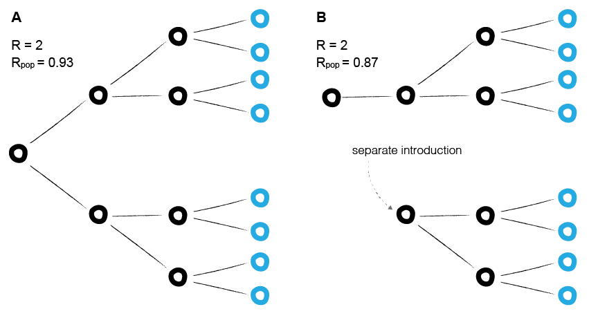

```{r setup, include=FALSE}
knitr::opts_knit$set(root.dir="../")
knitr::opts_chunk$set(fig.width=7.5, fig.height=6, fig.path='../figures/fig_data/', warning=FALSE, message=FALSE,cache=FALSE,dev=c('png','pdf'))
```

```{r packages, echo=FALSE}

# packages needed for analytical plots and heatmaps
library(phylosamp)
library(ggplot2)
library(RColorBrewer)
library(reshape2)
library(dplyr)
library(grid)
library(gridExtra)
library(cowplot)
library(pbapply)

# load extra functions for plotting
source("source/plot_func.R")

# load table containing the density distribution of the mean number of generations between cases
mgd <- read.csv("data/sim_distance_dist.csv")

```

<br>

##### **Fig S1.** Estimating the average reproductive number in a population



<br>

##### **Fig S2.** Effect of the reproductive number and number of generations on the distribution of generations between cases

```{r gen_dist_survey, echo=FALSE, eval=TRUE}

mgdc <- read.csv("data/sim_distance_dist_compare.csv")
plots <- vector(mode = "list", length = dim(mgdc)[1])
for (i in 1:dim(mgdc)[1]){
  pdf <- as.numeric(mgdc[i,][3:dim(mgdc)[2]])
  df <- data.frame(x=0:(length(pdf)-1),pdf=pdf)
  plots[[i]] <- ggplot(data=df, aes(x=x, y=pdf)) + 
    geom_bar(stat="identity") +
    #scale_x_continuous(limits=c(0,40)) +
    annotate(geom = 'text', label = paste("G =",mgdc[i,"d"]), x = 35, y = 0.95*max(df$pdf)) +
    theme_bw() +
    theme(axis.title.x=element_blank(),axis.title.y=element_blank())
}

p1 <- grid.arrange(arrangeGrob(plots[[1]],left="R = 1.5"),plots[[2]],plots[[3]],
                   arrangeGrob(plots[[4]],left="R = 3"),plots[[5]],plots[[6]],
                   arrangeGrob(plots[[7]],left="R = 6"),plots[[7]],plots[[8]],
                   ncol=3, widths = c(4.35,4,4), heights = c(4,4,4))

```

<br>

##### **Fig S3.** Genetic distance distributions for different types of pathogens

```{r gen_dist_compare_ebov, echo=FALSE, fig.width=7.5, fig.height=6, eval=TRUE}

# ebola-like pathogen
R <- 1.5
mut_rate <- 1

mean_gens_pdf <- mgd[mgd["R"]==R][3:dim(mgd)[2]]
plt.gendist.mut(mut_rate = mut_rate, mean_gens_pdf = mean_gens_pdf)

```

```{r gen_dist_compare_mev, echo=FALSE, fig.width=7.5, fig.height=6, eval=TRUE}

# faster-spreading pathogen
R <- 3
mut_rate <- 0.2

mean_gens_pdf <- mgd[mgd["R"]==R][3:dim(mgd)[2]]
plt.gendist.mut(mut_rate = mut_rate, mean_gens_pdf = mean_gens_pdf)

```

<br>

##### **Table S1.** Error of false discovery rate calculation by sample size

```{r error_table_sim_samplesize, echo=FALSE, fig.width=6, fig.height=10, eval=TRUE}

# values in common for all tables
row_breaks=c(0.0,0.25,0.5,0.75,1.0)
row_names=c("0.00-0.25","0.25-0.50","0.50-0.75","0.75-1.00")
max_sim_size = 2000

# A: proportion sampled = 0.10
rho = 0.1
col_breaks = c(0,0.25,0.5,0.75,1.0)*max_sim_size*rho
col_names = c("0-50","50-100","100-150","150-200")
error_table_ss_rho10 <- fdr.make.tables.var(
  saved_data="data/full_data_sim.Rdata",var="err",rho=rho,row_break_by="tfdr",
  row_breaks=row_breaks,row_names=row_names,
  col_break_by="M",col_breaks=col_breaks,col_names=col_names)

# B: proportion sampled = 0.25
rho = 0.25
col_breaks = c(0,0.25,0.5,0.75,1.0)*max_sim_size*rho
col_names = c("0-125","125-250","250-375","375-500")
error_table_ss_rho25 <- fdr.make.tables.var(
  saved_data="data/full_data_sim.Rdata",var="err",rho=rho,row_break_by="tfdr",
  row_breaks=row_breaks,row_names=row_names,
  col_break_by="M",col_breaks=col_breaks,col_names=col_names)

# C: proportion sampled = 0.5
rho = 0.5
col_breaks = c(0,0.25,0.5,0.75,1.0)*max_sim_size*rho
col_names = c("0-250","250-500","500-750","750-1000")
error_table_ss_rho50 <- fdr.make.tables.var(
  saved_data="data/full_data_sim.Rdata",var="err",rho=rho,row_break_by="tfdr",
  row_breaks=row_breaks,row_names=row_names,
  col_break_by="M",col_breaks=col_breaks,col_names=col_names)

# D: proportion sampled = 0.75
rho = 0.75
col_breaks = c(0,0.25,0.5,0.75,1.0)*max_sim_size*rho
col_names = c("0-375","375-750","750-1125","1125-1500")
error_table_ss_rho75 <- fdr.make.tables.var(
  saved_data="data/full_data_sim.Rdata",var="err",rho=rho,row_break_by="tfdr",
  row_breaks=row_breaks,row_names=row_names,
  col_break_by="M",col_breaks=col_breaks,col_names=col_names)

# plot the tables together
trho10 <- textGrob("A (proportion sampled = 0.10)", gp=gpar(fontsize=12), hjust = 0)
trho25 <- textGrob("B (proportion sampled = 0.25)", gp=gpar(fontsize=12), hjust = 0)
trho50 <- textGrob("C (proportion sampled = 0.50)", gp=gpar(fontsize=12), hjust = 0)
trho75 <- textGrob("D (proportion sampled = 0.75)", gp=gpar(fontsize=12), hjust = 0)
grid.arrange(trho10,tableGrob(error_table_ss_rho10),
             trho25,tableGrob(error_table_ss_rho25),
             trho50,tableGrob(error_table_ss_rho50),
             trho75,tableGrob(error_table_ss_rho75),nrow=8,heights=c(1,7,1,7,1,7,1,7))

```

<br>

##### **Fig S4.** Error of false discovery rate calculation by sensitivity and specificity

```{r error_heatmap_sim, echo=FALSE, fig.width=4, fig.height=6, eval=TRUE}
sens <- seq(0,1,length.out = 50)
spec <- seq(0,1,length.out = 50)
make.error.heatmaps(saved_data="data/full_data_sim.Rdata",rho=0.75,sens=sens,spec=spec,
                    sens_breaks=c(0,0.2,0.4,0.6,0.8,1.0),spec_breaks=c(0,0.2,0.4,0.6,0.8,1.0))
```

```{r error_heatmap_sim_zoom, echo=FALSE, fig.width=4, fig.height=6, eval=TRUE}
sens <- seq(0,1,length.out = 50)
spec <- seq(0.9,1,length.out = 50)
make.error.heatmaps(saved_data="data/full_data_sim.Rdata",rho=0.75,sens=sens,spec=spec,
                    sens_breaks=c(0,0.2,0.4,0.6,0.8,1.0),spec_breaks=c(1.0,0.02,0.04,0.06,0.08,0.10))
```

<br>

##### **Table S2.** Error and bias of false discovery rate calculation using mutation rate method

```{r res_table_mut, echo=FALSE, fig.width=6, fig.height=5, eval=TRUE}

bias_table_mutrate <- fdr.make.tables(saved_data="data/full_data_mutrate.Rdata",var="bias",
                break_by="tfdr",row_breaks=row_breaks,row_names=row_names)

error_table_mutrate <- fdr.make.tables(saved_data="data/full_data_mutrate.Rdata",var="err",
                break_by="tfdr",row_breaks=row_breaks,row_names=row_names)

tbias <- textGrob("A (Bias)", gp=gpar(fontsize=12), hjust = 0)
terror <- textGrob("B (Error)", gp=gpar(fontsize=12), hjust = 0)
grid.arrange(tbias,tableGrob(bias_table_mutrate),terror,tableGrob(error_table_mutrate),nrow=4,heights=c(1,7,1,7))

```

<br>

##### **Table S3** Error and bias of false discovery rate calculation using mutation rate method by sample size

```{r error_table_mut_samplesize, echo=FALSE, fig.width=6, fig.height=10, eval=TRUE}

# A: proportion sampled = 0.10
rho = 0.1
col_breaks = c(0,0.25,0.5,0.75,1.0)*max_sim_size*rho
col_names = c("0-50","50-100","100-150","150-200")
error_table_ss_rho10 <- fdr.make.tables.var(
  saved_data="data/full_data_mutrate.Rdata",var="err",rho=rho,row_break_by="tfdr",
  row_breaks=row_breaks,row_names=row_names,
  col_break_by="M",col_breaks=col_breaks,col_names=col_names)

# B: proportion sampled = 0.25
rho = 0.25
col_breaks = c(0,0.25,0.5,0.75,1.0)*max_sim_size*rho
col_names = c("0-125","125-250","250-375","375-500")
error_table_ss_rho25 <- fdr.make.tables.var(
  saved_data="data/full_data_mutrate.Rdata",var="err",rho=rho,row_break_by="tfdr",
  row_breaks=row_breaks,row_names=row_names,
  col_break_by="M",col_breaks=col_breaks,col_names=col_names)

# C: proportion sampled = 0.5
rho = 0.5
col_breaks = c(0,0.25,0.5,0.75,1.0)*max_sim_size*rho
col_names = c("0-250","250-500","500-750","750-1000")
error_table_ss_rho50 <- fdr.make.tables.var(
  saved_data="data/full_data_mutrate.Rdata",var="err",rho=rho,row_break_by="tfdr",
  row_breaks=row_breaks,row_names=row_names,
  col_break_by="M",col_breaks=col_breaks,col_names=col_names)

# D: proportion sampled = 0.75
rho = 0.75
col_breaks = c(0,0.25,0.5,0.75,1.0)*max_sim_size*rho
col_names = c("0-375","375-750","750-1125","1125-1500")
error_table_ss_rho75 <- fdr.make.tables.var(
  saved_data="data/full_data_mutrate.Rdata",var="err",rho=rho,row_break_by="tfdr",
  row_breaks=row_breaks,row_names=row_names,
  col_break_by="M",col_breaks=col_breaks,col_names=col_names)

# plot the tables together
trho10 <- textGrob("A (proportion sampled = 0.10)", gp=gpar(fontsize=12), hjust = 0)
trho25 <- textGrob("B (proportion sampled = 0.25)", gp=gpar(fontsize=12), hjust = 0)
trho50 <- textGrob("C (proportion sampled = 0.50)", gp=gpar(fontsize=12), hjust = 0)
trho75 <- textGrob("D (proportion sampled = 0.75)", gp=gpar(fontsize=12), hjust = 0)
grid.arrange(trho10,tableGrob(error_table_ss_rho10),
             trho25,tableGrob(error_table_ss_rho25),
             trho50,tableGrob(error_table_ss_rho50),
             trho75,tableGrob(error_table_ss_rho75),nrow=8,heights=c(1,7,1,7,1,7,1,7))

```

<br>

##### **Fig S5.** Predicted versus observed sensitivity using mutation rate method

```{r fdr_vs_fdr_mut_sens, echo=FALSE, eval=TRUE}

# make the sensitivity versus sensitivity plot
plt.sim.data(simdata="data/full_data_mutrate.Rdata",rho_values=c(0.1,0.25,0.5,0.75),max_sim_size=2000,
             xparam="t.eta",yparam="eta.full",axis_labels=c("Theoretical Sensitivity","Simulated Sensitivity"))

```

<br>

##### **Fig S6.** Predicted versus observed specificity using mutation rate method

```{r fdr_vs_fdr_mut_spec, echo=FALSE, eval=TRUE}

# make the specificity versus specificity plot
plt.sim.data(simdata="data/full_data_mutrate.Rdata",rho_values=c(0.1,0.25,0.5,0.75),max_sim_size=2000,
             xparam="t.chi",yparam="chi.full",axis_labels=c("Theoretical Specificity","Simulated Specificity"))

```

<br>

##### **Fig S6.** Distribution of raw errors using mutation rate method (optimal threshold only)

```{r error_hist_all, echo=FALSE, eval=TRUE, fig.width=7.5, fig.height=4, warning=FALSE}

err_hists_single <- plot.error.hist(saved_data="data/full_data_mutrate.Rdata",single_value=TRUE)

blank <- textGrob("",gp=gpar(fontsize=8))
rho10 <- textGrob("Sampling proportion: 0.1",gp=gpar(fontsize=8),hjust=0.37)
rho25 <- textGrob("Sampling proportion: 0.25",gp=gpar(fontsize=8),hjust=0.37)
rho50 <- textGrob("Sampling proportion: 0.5",gp=gpar(fontsize=8),hjust=0.37)
rho75 <- textGrob("Sampling proportion: 0.75",gp=gpar(fontsize=8),hjust=0.37)
toplabel <- textGrob("FDR", gp=gpar(fontsize=8), hjust = 0.3)
midlabel <- textGrob("Sensitivity", gp=gpar(fontsize=8), hjust = 0.4)
botlabel <- textGrob("Specificity", gp=gpar(fontsize=8), hjust = 0.4)
grid.arrange(blank,rho10,rho25,rho50,rho75,
             toplabel,err_hists_single[[1]],err_hists_single[[2]],
             err_hists_single[[3]],err_hists_single[[4]],
             midlabel,err_hists_single[[5]],err_hists_single[[6]],
             err_hists_single[[7]],err_hists_single[[8]],
             botlabel,err_hists_single[[9]],err_hists_single[[10]],
             err_hists_single[[11]],err_hists_single[[12]],
             nrow=4,widths=c(1.1,3,3,3,3),heights=c(1,8,8,8))

```

<br>

##### **Fig S7.** Predicted versus observed false discovery rate using actual generation distribution

```{r fdr_vs_fdr_gens, echo=FALSE, eval=TRUE}

# first time only: calculate tfdr from simulations and save to file

# load generation distribution data
rho_values=c(0.1,0.25,0.5,0.75)
mgd_list <- vector(mode = "list", length = 4)
for (i in 1:4){
  simpath <- paste("data/gendata_var_sim_N10000","_rho",as.character(100*rho_values[i]),".csv",sep="")
  mgd_list[[i]] <- read.csv(simpath)
  }

#calc.tfdr(simdata="data/simdata_var_gen_N10000",rho_values=rho_values,max_sim_size=2000,
#          sens_spec_method="mutrate",mgd=mgd_list,mgd_type="sim",outdir="data/full_data_mutrate_gens.Rdata")

# make the fdr versus fdr plot
plt.sim.data(simdata="data/full_data_mutrate_gens.Rdata",rho_values=c(0.1,0.25,0.5,0.75),max_sim_size=2000,
             xparam="tfdr",yparam="fdr.sub",axis_labels=c("Theoretical FDR","Simulated FDR"))

```
<br>

##### **Table S4.** Bias and error of false discovery rate using actual generation distribution

```{r res_table_gens, echo=FALSE, fig.width=6, fig.height=5, eval=TRUE}

# plot the bias from plot using true generation distribution
bias_table_gens <- fdr.make.tables(saved_data="data/full_data_mutrate_gens.Rdata",var="bias",
                break_by="tfdr",row_breaks=row_breaks,row_names=row_names)

# plot the error from plot using true generation distribution
error_table_gens <- fdr.make.tables(saved_data="data/full_data_mutrate_gens.Rdata",var="err",
                break_by="tfdr",row_breaks=row_breaks,row_names=row_names)

# plot the tables together
tbias <- textGrob("A (Bias)", gp=gpar(fontsize=12), hjust = 0)
terror <- textGrob("B (Error)", gp=gpar(fontsize=12), hjust = 0)
grid.arrange(tbias,tableGrob(bias_table_gens),terror,tableGrob(error_table_gens),nrow=4,heights=c(1,7,1,7))

```